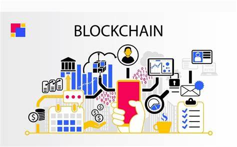

Title: Nghiên cứu về blockchain
Author : Võ Tấn Đạt
Date: 2019-11-01 00:00:00
---

## Danh mục
1. [ Lời giới thiệu](#1-giới-thiệu)
2. [ Blockchain là gì](#2-blockchain-là-gì)

## 1. Giới thiệu    
Đấy là nghiên cứu cá nhân của tôi về blockchain. 

## 2. Blockchain là gì

Blockchain là một công nghệ lưu trữ và truyền tải thông tin một cách công khai, dựa trên một mạng ngang hàng (peer-to-peer network). Các thông tin được lưu trữ trong blockchain được mã hóa và phân tán trên nhiều máy tính khác nhau, không có một trung tâm nào kiểm soát. Điều này giúp cho blockchain trở nên an toàn hơn, bảo mật hơn và khó bị tấn công hơn so với các hệ thống thông tin truyền thống.
## 3. Đặc điểm của blockchain
- **Immutability**:  Ai cũng có thể tham gia vào khối blockchain đó
- **Decentralization**:  Không có một trung tâm nào kiểm soát blockchain

