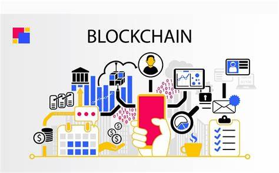
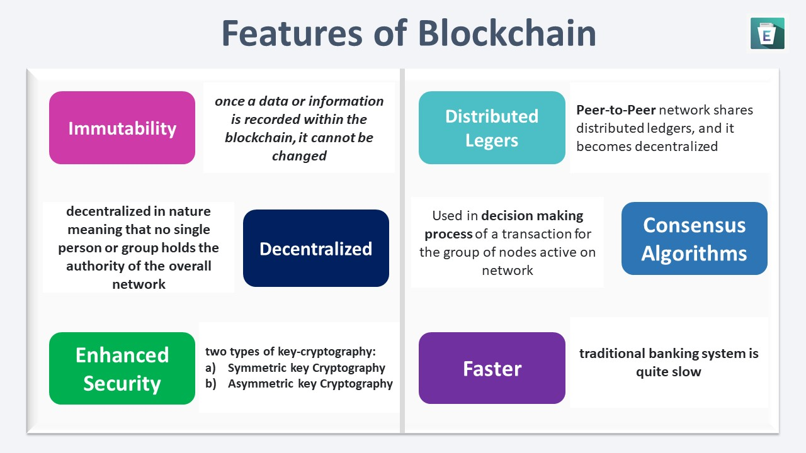
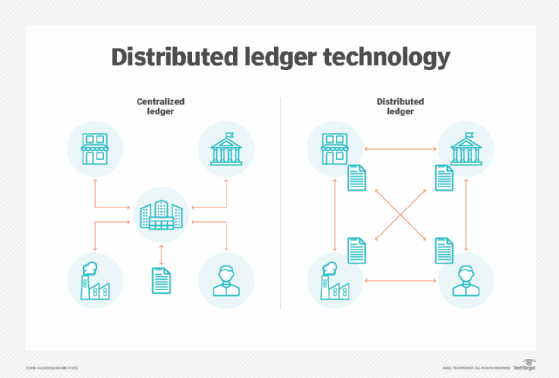

Title: Nghiên cứu về blockchain
Author : Võ Tấn Đạt
Date: 2019-11-01 00:00:00
---

## Danh mục
1. [ Lời giới thiệu](#1-giới-thiệu)
2. [ Blockchain là gì](#2-blockchain-là-gì)

## 1. Giới thiệu    
Đấy là nghiên cứu cá nhân của tôi về blockchain. 

## 2. Blockchain là gì

    

 
Blockchain là một công nghệ lưu trữ và truyền tải thông tin một cách công khai, dựa trên một mạng ngang hàng (peer-to-peer network). Các thông tin được lưu trữ trong blockchain được mã hóa và phân tán trên nhiều máy tính khác nhau, không có một trung tâm nào kiểm soát. Điều này giúp cho blockchain trở nên an toàn hơn, bảo mật hơn và khó bị tấn công hơn so với các hệ thống thông tin truyền thống.

## 3. Đặc điểm của blockchain

    

 

- **Immutable** (không thể thay đổi): Một khi thông tin đã được lưu trữ trong blockchain thì không thể bị thay đổi, kể cả người tạo ra nó chỉ có thể thêm vào. 
- **Decentralized** (phi tập trung): Các thông tin được lưu trữ trong blockchain được phân tán trên nhiều máy tính khác nhau, không có một trung tâm nào kiểm soát.
- **Enhanched Security** (bảo mật cao): Các thông tin được lưu trữ trong blockchain được mã hóa và phân tán trên nhiều máy tính khác nhau, không có một trung tâm nào kiểm soát.Hai khoá của key-crytography 
    - **Symmetric key Cryptography**: Đây còn được gọi là mật mã chìa khóa bí mật vì quá trình mã hóa và giải mã sử dụng cùng một chìa khóa. Kích thước của văn bản mã hóa nhỏ hơn hoặc bằng và quá trình mã hóa rất nhanh chóng. Nó có thể chuyển một lượng lớn dữ liệu với tính bảo mật.

    - **Asymmetric key Cryptography** Đây được gọi là mật mã chìa khóa công khai. Nó nằm ở phía ngược lại của mật mã chìa khóa bí mật, bởi vì quá trình mã hóa và giải mã sử dụng các chìa khóa khác nhau. Chìa khóa công khai được sử dụng trong quá trình mã hóa và chìa khóa riêng tư được sử dụng trong quá trình giải mã. Nó chỉ có thể chuyển một lượng nhỏ dữ liệu, nhưng đảm bảo tính xác thực và tính bảo mật.
- **Distributed Ledger** (sổ cái phân tán): Điều này là cấu trúc của blockchain làm cho nó độc đáo, trong đó mạng P2P (Peer-to-Peer) xử lý toàn bộ công nghệ blockchain. Mạng P2P này chia sẻ sổ cái phân phối, làm cho nó trở nên phi tập trung. Dữ liệu trên hệ thống sổ cái được lưu trữ trong một khối và được nhóm lại bởi các nút (nodes). Khi các khối dữ liệu được liên kết với nhau và nhờ vào các thuật toán băm mật mã, nó đạt được tính bảo mật tăng cường. Tính bảo mật nâng cao này và sổ cái phân phối giúp giới thiệu tính không thể biến đổi vào hệ thống.

    

